# Fliplearn
<!--
*** Thanks for checking out this README. If you have a suggestion that would
*** make this better, please fork the repo and create a pull request or simply open
*** an issue with the tag "enhancement".
*** Thanks again! Now go create something AMAZING! :D
-->


<!-- SIH PROJECT -->
<!--
*** I'm using markdown "reference style" links for readability.
*** Reference links are enclosed in brackets [ ] instead of parentheses ( ).
*** See the bottom of this document for the declaration of the reference variables
*** for contributors-url, forks-url, etc. This is an optional, concise syntax you may use.
*** https://www.markdownguide.org/basic-syntax/#reference-style-links
-->
[![Contributors][contributors-shield]][contributors-url]
[![Forks][forks-shield]][forks-url]
[![Stargazers][stars-shield]][stars-url]
[![Issues][issues-shield]][issues-url]
[![MIT License][license-shield]][license-url]
[![LinkedIn][linkedin-shield]][linkedin-url]


<!-- PROJECT LOGO -->
<br />
<p align="center">
  <a href="https://github.com/gaurishanand13/F-Fliplearn">
    
  </a>

  <h3 align="center">Fliplearn Hackathon 2020</h3>

  <p align="center">
     Problem Statement: EdTech - Build the Future of Education using Technology
    <br />
    <a href="https://github.com/gaurishanand13/F-Fliplearn"><strong>Explore the docs »</strong></a>
    <br />
    <br />
    <a href="https://drive.google.com/file/d/1U8ej1TCvbpz2laJSH2cGTOntZWKRngtQ/view?usp=drivesdk">View Demo</a>
    ·
    <a href="https://github.com/gaurishanand13/F-Fliplearn/issues">Report Bug</a>
    ·
    <a href="https://github.com/gaurishanand13/F-Fliplearn/issues">Request Feature</a>
  </p>
</p>


<!-- TABLE OF CONTENTS -->
## Table of Contents

* [About the Project](#about-the-project)
  * [Built With](#built-with)
  * [App Screenshots](#app-screenshots)
* [Getting Started](#getting-started)
* [Contributing](#contributing)
* [License](#license)
* [Contact](#contact)
* [Acknowledgements](#acknowledgements)


<!-- ABOUT THE PROJECT -->
## About The Project

#### FLIPLEARN ASSISTANT:
A voice enabled bot that gives personalized test/course recommendations and provide feedback based on performance of student.

#### Online Examination Proctoring using AI
Due to the pandemic, the education is completely virtual. There is no fool proof platform to proctor students in online examination. So an attempt is made to solve this.

#### Gamification of platform by rewarding flip coins to increase student engagement. Eg. rewarding students flipcoins if they solve doubts of other students.


### Built With
This section should list any major frameworks that you built your project using. Leave any add-ons/plugins for the acknowledgements section. Here are a few examples.
* [Jetpack Components](https://developer.android.com/jetpack)
* [Firebase](https://firebase.google.com/)
* [Retrofit](https://square.github.io/retrofit/)
* [Youtube SDK](https://developers.google.com/youtube/android/player)


### App Screenshots
| 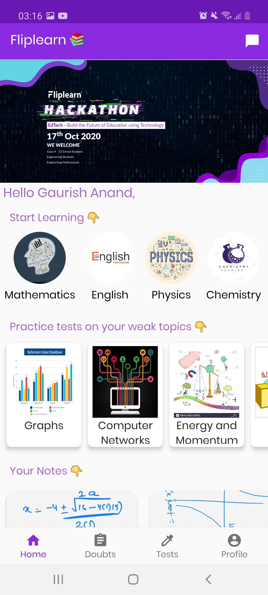 | 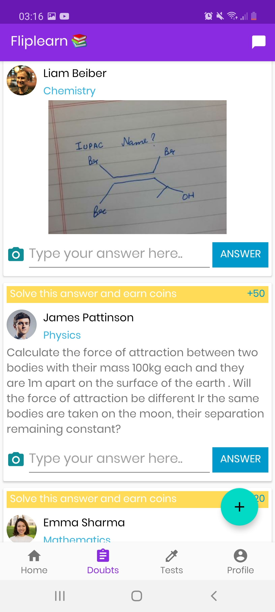 | 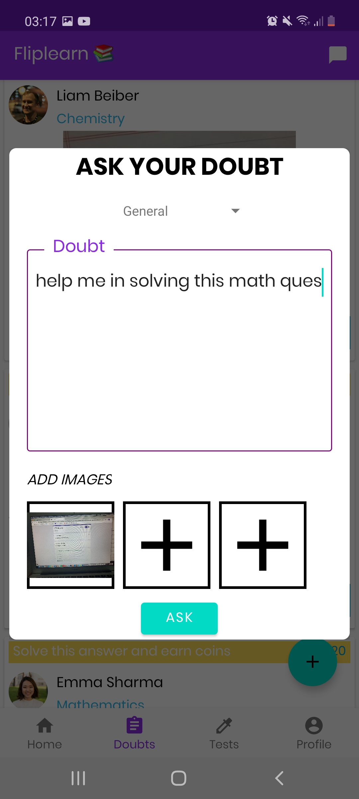 |
|:---:|:---:|:---:|
| Home | Doubt Section | Asking a Doubt |

| 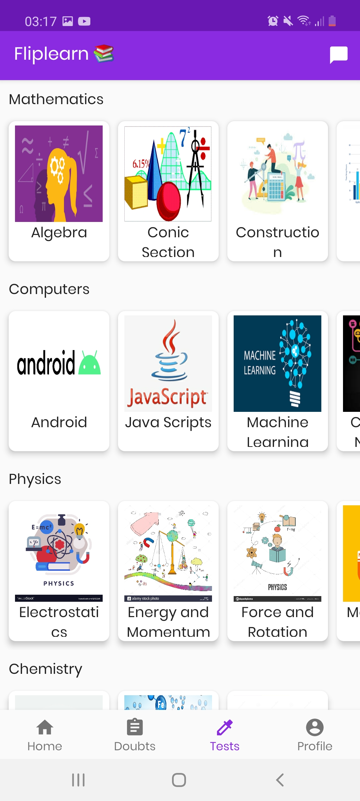 | 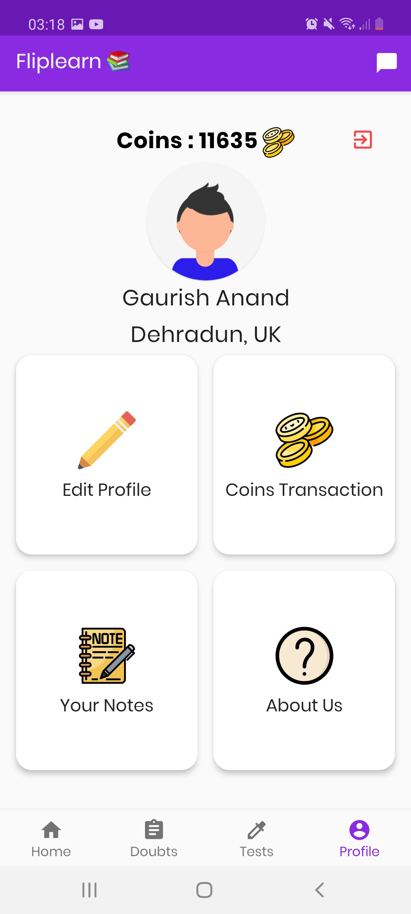 | 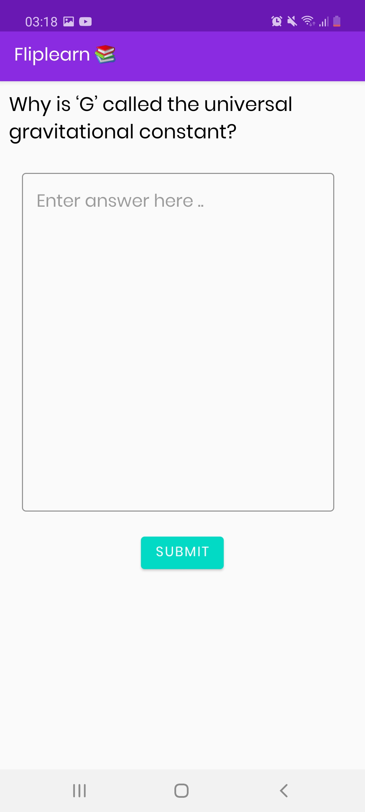 |
|:---:|:---:|:---:|
| Live tests for students | Student's Profile | Attempting a test |

| 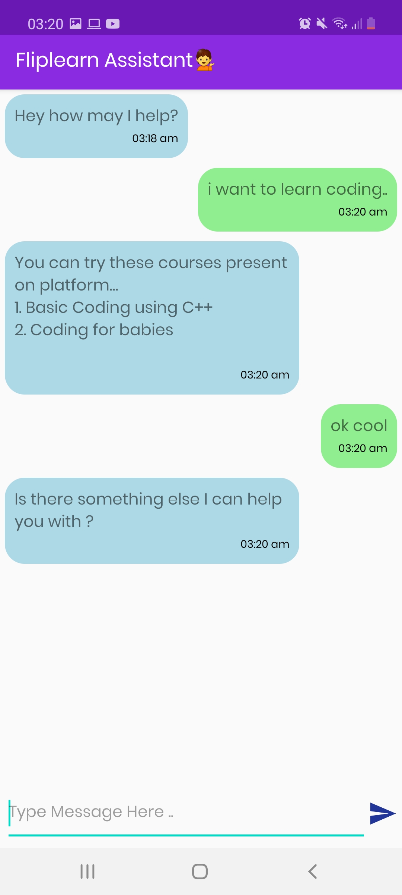 | 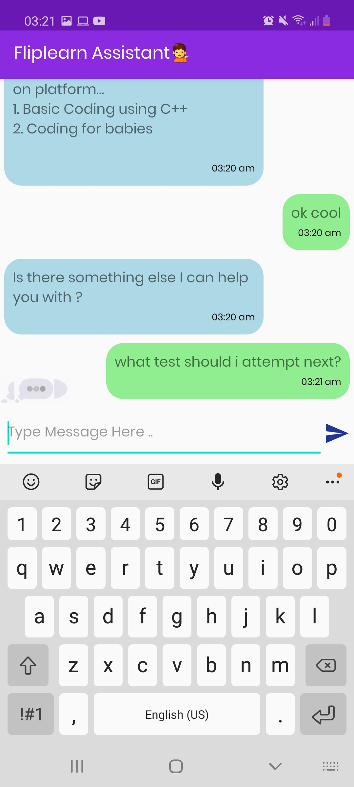 | 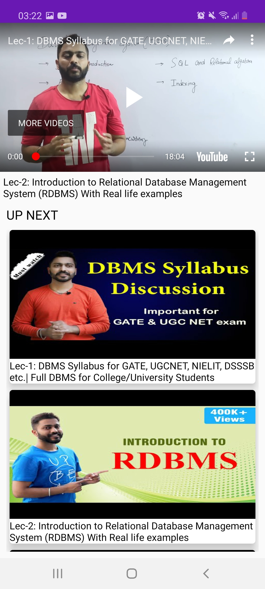 |
|:---:|:---:|:---:|
| Course Recommendation | Test Recommendation | Courses Videos |

| 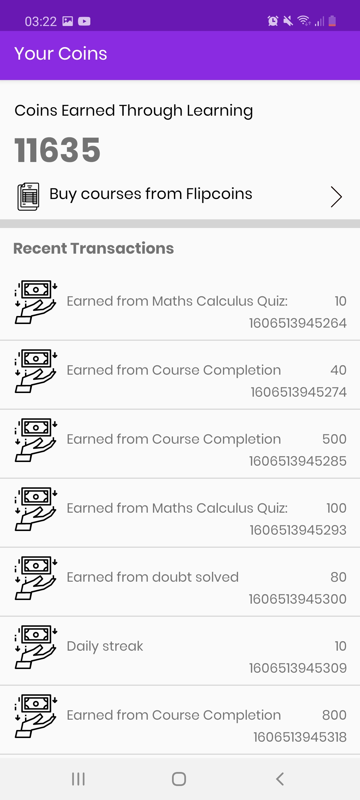 | 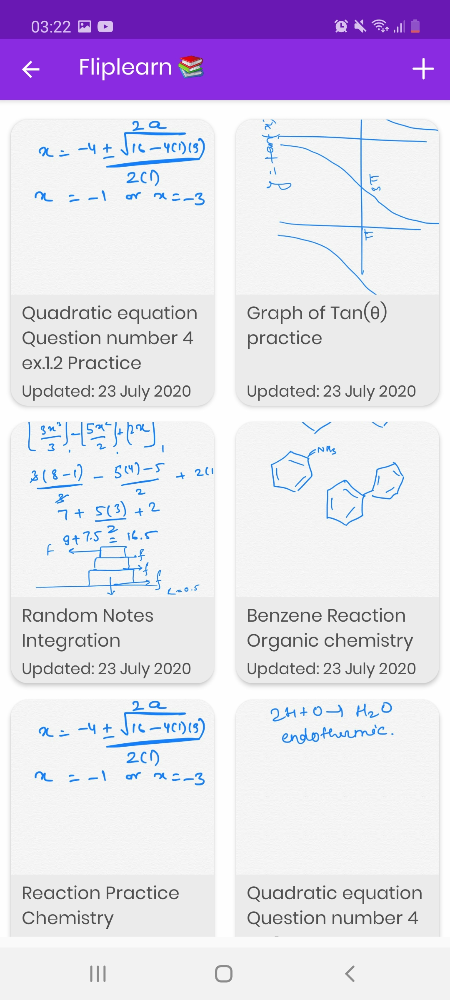 | 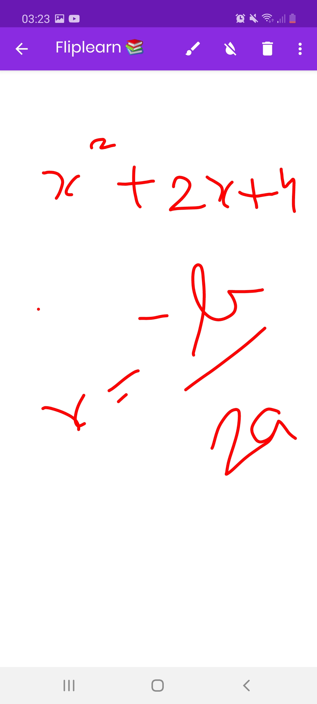 |
|:---:|:---:|:---:|
| Flipcoin's Transaction | Fliplearn Notes | Make your Note |


<!-- GETTING STARTED -->
## Getting Started

 Cloning from github
```sh
git clone git@github.com:gaurishanand13/F-Fliplearn.git
cd F-Fliplearn/
```

If Android SDK and Android NDK are already installed you can install this application to the connected android device or emulator with:
```sh
./gradlew installDebug
```


<!-- CONTRIBUTING -->
## Contributing

For contributing to this project do follow the below steps. Any contributions you make are **greatly appreciated**.

1. Fork the Project
2. Create your Feature Branch (`git checkout -b feature/AmazingFeature`)
3. Commit your Changes (`git commit -m 'Add some AmazingFeature'`)
4. Push to the Branch (`git push origin feature/AmazingFeature`)
5. Open a Pull Request


<!-- LICENSE -->
## License

Distributed under the MIT License. See `LICENSE` for more information.


<!-- CONTACT -->
## Contact
Shivam Kumar - [@shivamkumard107](https://www.linkedin.com/in/shivam-kumar-a9aa96131/) - shivam.kumard107@gmail.com


<!-- ACKNOWLEDGEMENTS -->
## Acknowledgements
* [Gaurish Anand](https://github.com/gaurishanand13)
* [Chirag Singla](https://github.com/chiragsingla17)


<!-- MARKDOWN LINKS & IMAGES -->
<!-- https://www.markdownguide.org/basic-syntax/#reference-style-links -->
[contributors-shield]: https://img.shields.io/github/contributors/shivamkumard107/KisanSeva2.svg?style=flat-square
[contributors-url]: https://github.com/shivamkumard107/KisanSeva2/graphs/contributors
[forks-shield]: https://img.shields.io/github/forks/shivamkumard107/KisanSeva2.svg?style=flat-square
[forks-url]: https://github.com/shivamkumard107/KisanSeva2/network/members
[stars-shield]: https://img.shields.io/github/stars/shivamkumard107/KisanSeva2.svg?style=flat-square
[stars-url]: https://github.com/shivamkumard107/KisanSeva2/stargazers
[issues-shield]: https://img.shields.io/github/issues/shivamkumard107/KisanSeva2.svg?style=flat-square
[issues-url]: https://github.com/shivamkumard107/KisanSeva2/issues
[license-shield]: https://img.shields.io/github/license/shivamkumard107/KisanSeva2.svg?style=flat-square
[license-url]: https://github.com/shivamkumard107/KisanSeva2/blob/master/LICENSE
[linkedin-shield]: https://img.shields.io/badge/-LinkedIn-black.svg?style=flat-square&logo=linkedin&colorB=555
[linkedin-url]: https://www.linkedin.com/in/gaurish-anand-b84393a7/
[product-screenshot]: images/icon.svg
